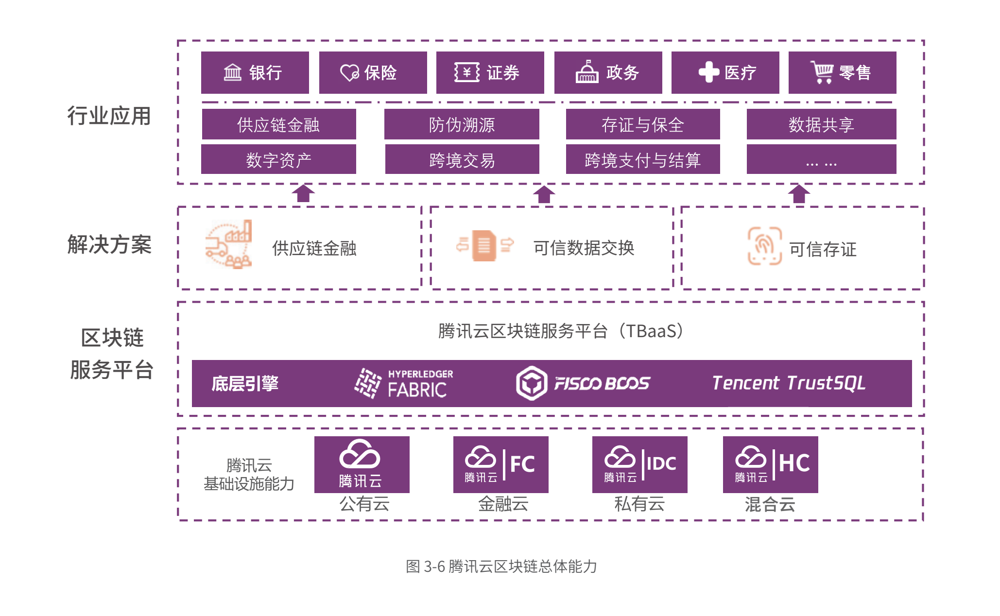

# MPC 算法研究

MPC：多方安全计算(Secure Multi-Party Computation)是指在无可信第三方情况下，通过多方共同参与，安全地完成某种协同计算。即在一个分布式的网络中，每个参与者都各自持有秘密输入，希望共同完成对某个函数的计算，但要求每个参与者除计算结果外均不能得到其他参与实体的任何输入信息。

- [MPC 算法研究](#mpc-算法研究) 
  - [安全模型](#安全模型)
  - [基础算法分类](#基础算法分类)
    - [混淆电路(Garbled Circuit)](#混淆电路garbled-circuit)
    - [同态加密 (Homomorphic Encryption)](#同态加密-homomorphic-encryption)
    - [秘密共享(Secret Sharing)](#秘密共享secret-sharing)
    - [不经意传输 (Oblivious Transfer)](#不经意传输-oblivious-transfer)
  - 特殊相关案例详解：
    - [隐私查询(Private Information Retrival)](#隐私查询private-information-retrival)
    - [基于RSA盲签名的加密实体对齐](#rsa盲签名)  
  - [参考文献](#参考文献)

## 安全模型
### 攻击者行为模型（Adversarial Behavior）：
  - 半诚实模型（Semi-honest）：攻击者不会主动向系统发起攻击，即攻击者忠实地执行协议内容，但会尝试通过收集并分析所得信息推测秘密内容。
  - 恶意模型（Malicious）：攻击者能够输入、删除通信通道中的内容信息，通过恶意输入来获得秘密内容或导致错误的输出结果。
  - 隐蔽模型（Covert）：攻击者能够输入、删除通信通道中的内容信息，通过恶意输入来获得秘密内容或导致错误的输出结果，但如果攻击者了解他们的行为会被发现并确认身份，则攻击者不会选择发起攻击。
### 腐化模型（Corruption Strategy）：
  - 静态腐化模型（Static Corruption Model）：恶意参与者在网络中的数量与个体在协议进程中保持静止，最开始的非恶意参与者会在进程中一直保持诚实状态。
  - 自适应性腐化模型（Adaptive Corruption Model）：恶意参与者在网络中的数量和个体在协议进程中是非静止的，最开始非恶意参与者可能会在协议进程中改变状态，或是因为受到攻击从而执行非诚实/恶意行为。

## 基础算法分类

### 混淆电路(Garbled Circuit)

略

### 同态加密 (Homomorphic Encryption)

RSA 算法
ElGamal 算法
Pailliar 算法
- 公私钥生成

  生成大素数p, q, 计算, 
    
- 加密
- 解密
### 秘密共享(Secret Sharing)

- Shamir 算法

特点: 能够重构秘密

- Feldman 算法（在Shamir基础上添加校验）
- Behaloh 算法（在Shamir基础上添加校验）
- Amir Herzberg 算法 **动态秘密共享**

  基于Shamir/Feldman/Behaloh算法秘密共享方案存在周期上的安全性问题，即该类算法默认恶意攻击者永远无法获取t个子秘密，然而在较长周期下，该前提较难成立。
  因此, Amir Herzberg算法的优势之一在于采取了一种动态的秘密共享方案，在保证秘密不变的情况下周期性地更换子秘密，从而使得每次更换子秘密时攻击者在前一个周期内所获得的信息完全失效。
  具体算法理论：
  
### 不经意传输 (Oblivious Transfer)

根据传输信息数量级不同的分类：

-   : 1-out-of-n(多选一)不经意传输
  - 信息供给方A提供$n$条消息:$\{m_{i}\}_{i=1}^n$,协议执行后，接收方B得到其中的一个消息（保证对A的隐私性）,A不知道B选择的是哪一个消息（保证对B的隐私性），B可以确信他得到了想要的消息（正确性）。
- **$OT_{n}^k$** : k-out-of-n(多选多)不经意传输
  - 信息供给方A提供$n$条消息:$\{m_{i}\}_{i=1}^n$,协议执行后，接收方B得到其中的$k(k<n)$个消息（保证对A的隐私性）,A不知道B选择的是哪些消息（保证对B的隐私性），B可以确信他得到了想要的消息（正确性）。

根据实施方法不同：

- 非适应性不经意传输：
  - 接收方B事先确定自己将要的得到的秘密，在协议中途不可更改选择，主要用于一般的额多方安全计算设计。
- 适应性不经意传输：
  - 接收方B在线决定自己将要获取的秘密，而发送方A事先确定将要发送的秘密，主要用于保护隐私的数据库搜索。  
    - __腾讯TBaaS中TrustSQL解决方案应该是基于该类实施思路（具体待查）__

### 基于RSA盲签名的加密实体对齐

基础符号标注与假设：Client持有原始数据 $D_c$与公私匙对 $(e, d)$，Server持有原始数据 $D_s$。Client将公匙 $d$ 交予Server。

具体参考文献[1](https://drum.lib.umd.edu/bitstream/handle/1903/1339/CS-TR-4564.pdf?sequence=1)

### 隐私查询(Private Information Retrival)

## 解决方案案例
### 一、[腾讯云TBaaS](https://cloud.tencent.com/product/tbaas/details)
总体架构图

- TrustSQL

参考: 

[2019腾讯TBaaS白皮书](https://main.qcloudimg.com/raw/55e6cfc4bf7df0e1a2f349204dbbcc32/2019%E8%85%BE%E8%AE%AF-%E5%8C%BA%E5%9D%97%E9%93%BE%E7%99%BD%E7%9A%AE%E4%B9%A6.pdf)

[腾讯产品文档](https://main.qcloudimg.com/raw/document/product/pdf/663_14010_cn.pdf)

### 二、 [华为区块链可信多方安全计算解决方案](https://www.huaweicloud.com/solution/blockchain-smpc.html)

总体架构图

- **联邦学习（特殊机器学习方案）** 可见附一

## 参考文献

[Privacy-Preserving Inter-Database Operations](https://drum.lib.umd.edu/bitstream/handle/1903/1339/CS-TR-4564.pdf?sequence=1)

[A Randomized Protocol for Signing Contracts](http://www.lix.polytechnique.fr/~catuscia/teaching/papers_and_books/SigningContracts.pdf)
